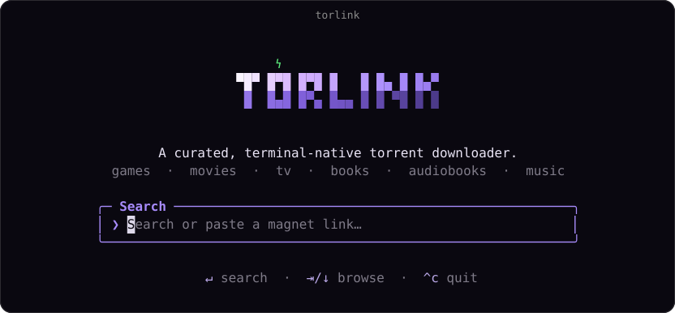
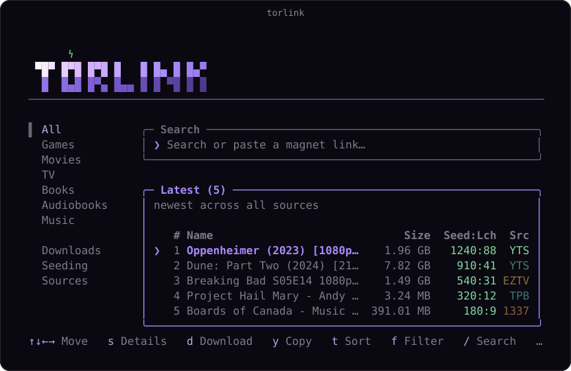
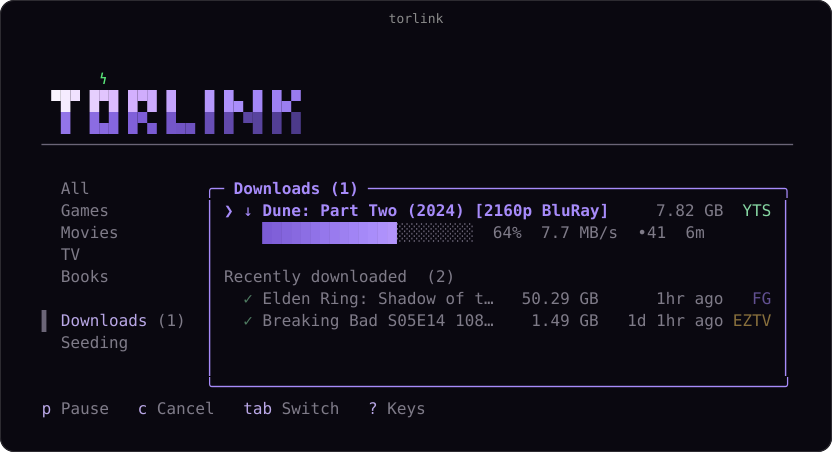

<p align="center">
  
</p>

Finding a torrent these days sucks. One site is a minefield of fake download buttons. Another hides the real link under a popup that spawns two more tabs. And after all that, half the results are dead, zero seeders.

torlink is a torrent finder that lives in your terminal. One search checks a short, curated list of reputable sources at once, and whatever you pick downloads straight to your computer through a TorLink-managed local Transmission daemon. The files are yours, saved to your downloads folder.

> **Fork status:** This is a classroom-oriented fork of
> [`baairon/torlink`](https://github.com/baairon/torlink), based on upstream
> commit `b8f8872`. It adds hardened terminal controls, an optional Surfshark
> gate, and a localhost-only Transmission backend. See
> [`FORK_NOTES.md`](FORK_NOTES.md) for provenance and the modification summary.

## Get started

1. **Install Node** from [nodejs.org](https://nodejs.org).
2. **Install Transmission's CLI backend** on macOS:

   ```sh
   brew install transmission-cli
   ```

3. **Open your terminal.**
4. **Start it:**

   ```sh
   npx torlnk
   ```

That's the only thing you'll type. torlink opens straight to a search bar: search for what you want, paste in a magnet link or a bare infohash, or just press Enter on an empty box to browse the curated library. From there it's all keypresses, nothing to memorize, and `?` brings up the full list anytime.

## Finding something

Type what you're looking for and press Enter. Results stream in from every source as they answer, tagged with size and how many people are sharing each one, so you can see what'll come down fast. Arrow to what you want and press `s` to inspect details and torrent options, or press `d` to save it.

<p align="center">
  
</p>

## Your downloads

Active downloads sit up top with their progress, speed, peers, and time left; when one finishes it drops into Recently downloaded just below, so the list stays tidy. Everything's still there when you come back, and anything interrupted picks up where it left off. Highlight an active download and press `Enter` to inspect its status, progress, speed, folder, hash, magnet, and torrent actions. Highlight a row and press `delete` to remove it from the Downloads page. Press `a` to toggle torrent auto-resume if you want unfinished downloads and active seeds to stay paused after a restart or VPN reconnect. Press `r` on a download or seed to ask Transmission to verify/rescan it. Press `e` to toggle auto-stop seeding if you want finished downloads to stop instead of seeding automatically. Press `v` to toggle the Surfshark VPN requirement.

Downloads run in the background while you keep searching, so you can queue up as many as you want. TorLink starts its own localhost-only `transmission-daemon` when needed and stops that managed daemon when TorLink exits. They save to your downloads folder, and the Downloads pane keeps tabs on each one. When something finishes it keeps seeding automatically so the next person can find it too, and the Seeding tab lets you pause or stop that anytime.

The Sources pane lets you turn individual providers on or off, including FitGirl, YTS, EZTV, The Pirate Bay, and 1337x providers. Disabled sources are skipped during search.

<p align="center">
  
</p>

## What it searches

A short, hand-picked list of trusted sources:

| Category | Sources |
| --- | --- |
| Games | FitGirl |
| Movies | YTS, The Pirate Bay, 1337x |
| TV | EZTV, The Pirate Bay, 1337x |
| Books | The Pirate Bay, 1337x |
| Audiobooks | The Pirate Bay, 1337x |
| Music | The Pirate Bay, 1337x |

Games are the only category that can run code, so they come from FitGirl alone, a repacker with a long, trusted track record; everything else is plain media. If a source is down, the search carries on without it, and torlink tells you which one is offline.

## Contributing

To run or work on torlink locally:

1. Clone the repository and open the folder.
2. Install dependencies:
   ```sh
   npm install
   ```
3. Run the development version:
   ```sh
   npm run dev
   ```
   Or build it and run the bundled version:
   ```sh
   npm run build
   npx torlnk
   ```

4. Run the verification gates:
   ```sh
   npm test
   npm run typecheck
   npm run build
   npm run verify:transmission
   npm audit
   ```

Before opening a PR, skim [CONTRIBUTING.md](CONTRIBUTING.md); it lays out the bar with examples from real merged PRs.

## Privacy

Your files stay on your disk, and nothing routes through a central server; torlink only talks to search sources and the torrent network directly. If Surfshark enforcement is on and Surfshark disconnects, TorLink stops active torrents and queues new ones paused until the gate opens again. This is an app-level pause/resume gate, not a system kill switch; enable Surfshark's own kill switch if you need protection when TorLink is killed unexpectedly.

Once a download finishes it keeps seeding by default, sharing it back so the next person can find it just as easily. The network only works because people pass things along, and even a few minutes makes a real difference. If you'd rather not, opt out anytime: open the Seeding tab, press `p` to pause or stop any item, and press it again to pick it back up. Always your call.

## Star History

<a href="https://www.star-history.com/?repos=baairon%2Ftorlink&type=date&legend=top-left">
 <picture>
   <source media="(prefers-color-scheme: dark)" srcset="https://api.star-history.com/chart?repos=baairon/torlink&type=date&theme=dark&legend=top-left" />
   <source media="(prefers-color-scheme: light)" srcset="https://api.star-history.com/chart?repos=baairon/torlink&type=date&legend=top-left" />
   
 </picture>
</a>
